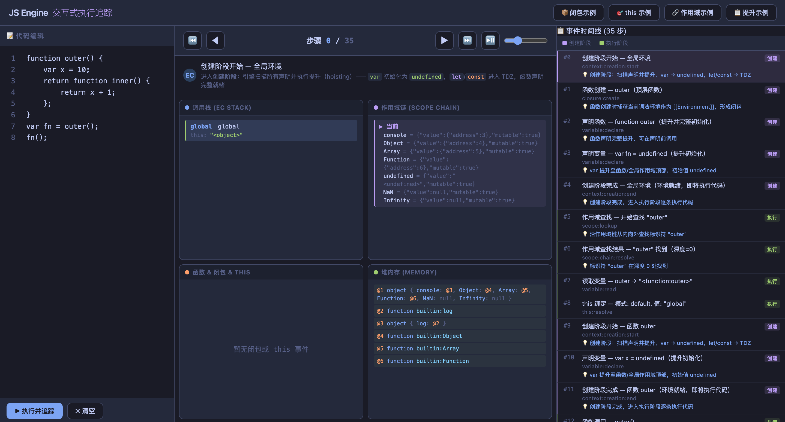

# JS Engine MVP

一个**纯 JavaScript 实现的可追踪 JavaScript 引擎**。核心目标不是执行性能，而是**完整的执行过程可观测性**——通过 27 种 hook 事件，追踪 JS 代码执行的每一步。

## 特性

- **完整的编译管道**：词法分析（Lexer）→ 语法分析（Parser）→ 解释执行（Evaluator）
- **ECMAScript 语义对齐**：var/let/const hoisting、TDZ、闭包、4 种 this 绑定规则、块级作用域
- **27 种 hook 事件**：覆盖词法、语法、内存、执行上下文、变量、作用域、闭包、this、函数调用全流程
- **显式创建/执行阶段分离**：`context:creation:start/end` 标记 EC 创建与代码执行两个阶段的边界
- **运行时状态查询**：实时获取调用栈、作用域链、堆内存快照
- **交互式追踪页面**：可视化步进控制，观察每一步的 EC 栈、作用域链、闭包、this、内存变化
- **零外部依赖**

## 快速开始

```bash
# 运行测试（8 个场景）
npm test

# 启动交互式执行追踪页面
npm run interactive
# 浏览器打开 http://localhost:3456
```

### 基础使用

```js
import { JSEngine, HookEvents } from './src/index.js';

const engine = new JSEngine();

// 注册 hook 监听执行过程
engine.on(HookEvents.CONTEXT_CREATION_START, (d) => console.log('创建阶段开始:', d.type, d.name));
engine.on(HookEvents.CONTEXT_CREATION_END, (d) => console.log('创建阶段完成:', d.type));
engine.on(HookEvents.CONTEXT_PUSH, (d) => console.log('EC 入栈:', d.type, d.name));
engine.on(HookEvents.CLOSURE_CREATE, (d) => console.log('闭包:', d.funcName, d.capturedVars));
engine.on(HookEvents.SCOPE_CHAIN_RESOLVE, (d) => console.log('作用域查找:', d.name, '深度:', d.depth));
engine.on(HookEvents.THIS_RESOLVE, (d) => console.log('this:', d.pattern, d.value));

// 执行代码
const result = engine.execute(`
    function outer() {
        var x = 10;
        function inner() {
            return x + 1;
        }
        return inner;
    }
    var fn = outer();
    fn();
`);
console.log('结果:', result); // 11

// 获取完整追踪日志
console.table(engine.getTrace());

// 查询运行时状态
console.log(engine.getCallStack());
console.log(engine.getScopeChain());
console.log(engine.getMemorySnapshot());
```

## 架构

```
源代码 ──▶ Lexer ──▶ Parser ──▶ Evaluator ──▶ 执行结果
               │          │           │
               └──────────┼───────────┘
                          ▼
                    HookSystem
                 (27 事件 + Trace)
                          │
                 ┌────────┼────────┐
                 ▼        ▼        ▼
              Memory   ECStack   Realm
                        │
                   Environment
                   Record / LE
```

## 支持的 JavaScript 子集

| 类别 | 支持 |
|------|------|
| 声明 | `var` / `let` / `const` + hoisting + TDZ |
| 类型 | number, string, boolean, null, undefined |
| 函数 | 声明 / 表达式 / 箭头函数 |
| 闭包 | `[[Environment]]` 捕获 + 作用域链查找 |
| this | 全局 / 方法调用 / call-apply-bind / 箭头 / new |
| 控制流 | if/else, for( ;; ), while |
| 字面量 | 对象 `{}`, 数组 `[]` |
| 运算符 | `+` `-` `*` `/` `%` `==` `===` `&&` `\|\|` `!` `typeof` `++` `--` `?:` `+=` `-=` `*=` |
| 其他 | 属性访问 `obj.prop` / `obj[expr]`, `new`, 注释 |

> 不支持：class、try-catch、async-await、解构、模板字符串、for...in/of、switch 等（后续迭代）

## 交互式追踪页面

```
npm run interactive
# 浏览器打开 http://localhost:3456
```

### 视图布局

三栏布局：**代码编辑**（左）→ **步骤控制 + 可视化面板**（中）→ **事件时间线**（右）


### 代码编辑区

- **行号显示**：左侧行号列，随滚动同步
- **锁定态**：函数执行期间，调用处行号紫色高亮 + 头部 `🔒` 指示器，从"作用域查找"覆盖到"函数返回"
- **步骤选中**：每步精确选中源码片段——声明选关键字+变量名、赋值选 `name = value`、调用选 `fn(args)`、读取选使用处标识符、成员访问扩展到 `obj.prop`
- **行/列指示器**：头部实时显示当前选中位置

### 事件时间线

- **阶段着色**：创建阶段（紫色边框 + `创建` 标签）、执行阶段（绿色 + `执行`）
- **知识点提示**：每步内置 💡 提示（var 提升 / let TDZ / 闭包原理 / this 规则 / 作用域查找等）
- **函数分类**：闭包（橙色，含捕获变量）、嵌套函数（紫色，无捕获）、顶层函数（青色）
- **选中态按阶段着色**：当前步根据创建/执行阶段显示不同高亮色

### 可视化面板

| 面板 | 联动高亮 |
|------|---------|
| **调用栈**（EC Stack） | 当前帧绿色边框，显示类型/名称/this 值 |
| **作用域链**（Scope Chain） | 查找变量时紫色高亮绑定名，读值时绿色高亮值 |
| **闭包 & this** | 真闭包（捕获外层变量）橙色，嵌套函数紫色，顶层函数青色；this 显示绑定模式与值 |
| **堆内存**（Memory） | 对象展开 `{ key: value }`，函数显示 `builtin:name` / `fn name`，数组 `[ ... ]`；读引用类型时联动高亮对应堆地址 |

### 调试模式

- 运行时报错不阻断回放——错误以横幅展示，仍可步进查看报错前的每一步状态
- 支持跨作用域同名变量（通过 `\b` 单词边界 + 作用域感知搜索正确匹配）
- 任意跳转步骤自动检测锁定态（前后扫描确定函数区间）

### 键盘快捷键

| 键 | 作用 |
|---|---|
| `←` `→` | 上/下一步 |
| `Home` / `End` | 跳到开头/末尾 |
| `Space` | 自动播放/暂停 |
| `Ctrl+Enter` | 执行代码 |

## 文档

| 文档 | 说明 |
|------|------|
| [系统架构](docs/design-arch.md) | 全景图、分层职责、5 项关键技术决策 |
| [技术详设](docs/tech-spec.md) | Lexer/Parser/Evaluator/Runtime 各模块算法详解 |
| [功能详设](docs/functional-spec.md) | hoisting/TDZ/闭包/this/作用域 逐个功能说明 |
| [用户手册](docs/user-guide.md) | 快速开始、API 参考、27 事件表、使用场景 |
| [开发手册](docs/dev-guide.md) | 模块依赖图、扩展指南、调试方法、代码规范 |
| [测试手册](docs/test-plan.md) | 14 个测试用例 + 回归检查清单 |

## 项目结构

```
js-engine-mvp/
├── src/
│   ├── index.js                  # 引擎入口
│   ├── types.js                  # 枚举常量
│   ├── stepper.js                # 步骤捕获器
│   ├── hooks/                    # 可观测性基础设施
│   ├── lexer/                    # 词法分析（字符 → Token）
│   ├── parser/                   # 语法分析（Token → AST）
│   ├── runtime/                  # 运行时（内存、环境、EC）
│   └── evaluator/                # AST 解释器
├── interactive/
│   ├── interactive.html           # 交互式可视化页面
│   ├── server.js                  # 交互式追踪 HTTP 服务
│   └── res.md                     # 步骤追踪记录
├── demo.js                        # 8 场景集成测试
├── docs/                          # 文档
├── package.json
└── .claude/
    ├── CLAUDE.md                  # 项目约束
    └── skills/                    # 项目/模块/功能级 Skill
```
